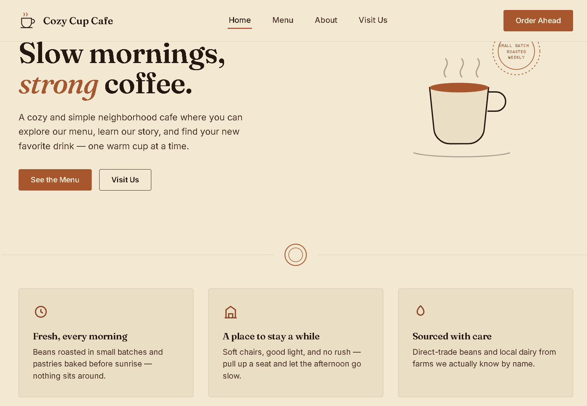
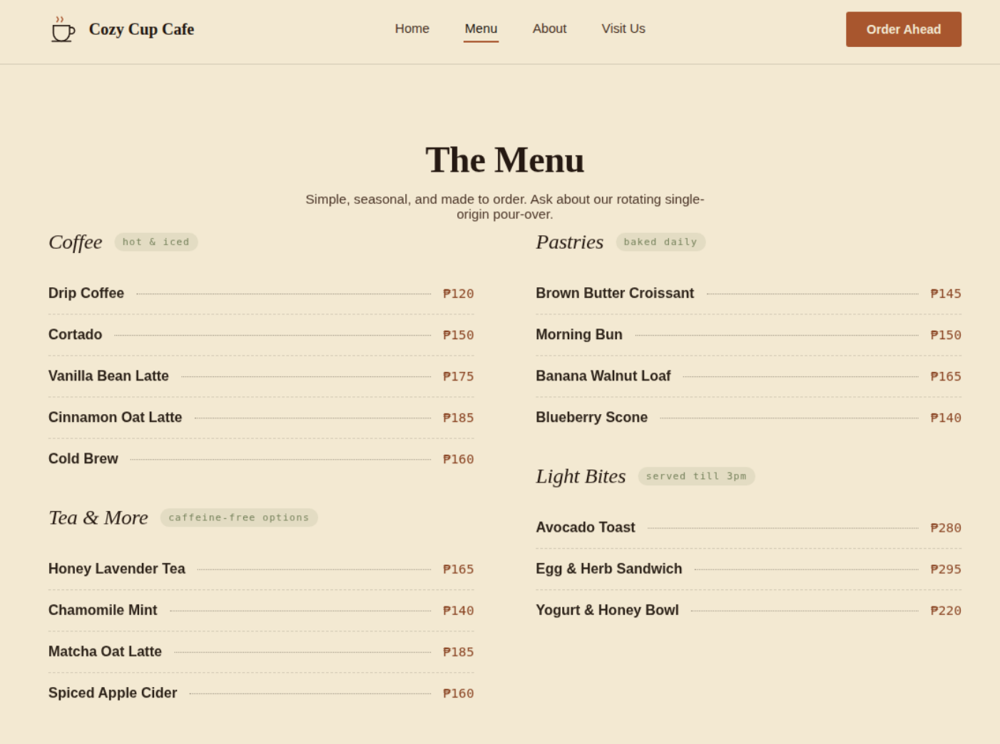
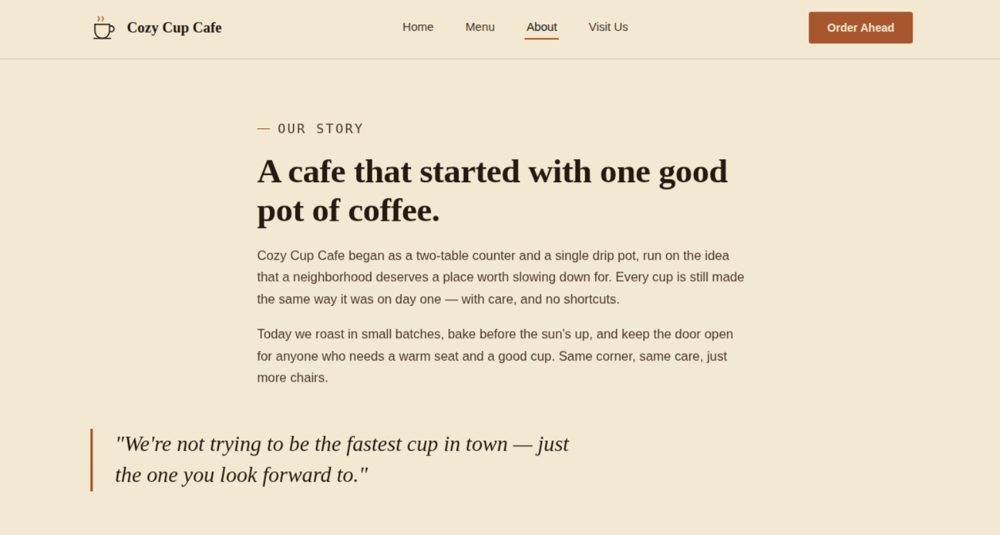
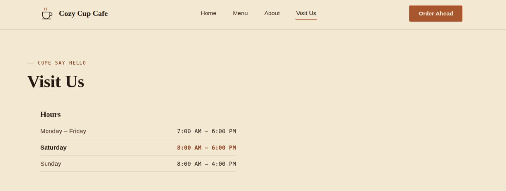

# ☕ Cozy Cup Cafe

## Project Description

Cozy Cup Cafe is a simple cafe website designed to provide customers with an easy and pleasant way to explore the cafe, view available drinks and food, and learn more about the cafe

## Features
+ 🏠 Home page
+ ☕ Coffee and drink menu
+ 🍰 Food and dessert menu
+ 📋 Product information
+ 📱 Simple and user-friendly interface

## Screen Captures
🏠 Home Page
a page of the project that will seemingly greets the customers 

  

### ☕ Menu Page
the page that will show the customers the available foods and drinks

  

### 👩‍🍳 About Page
the page that will tell the user or customer about them

  

### 📞 Visit Page
the page that tells customers when the cafe is open

  

## About the Authors
  <table align="center" width = 100%>
    <tr>
      <td align="center" width="50%" style="padding: 0 25px;">
          
        <b>Name: Aaron John B. Sulleza</b> 
        Email: sullezaaaron@gmail.com
      </td>
      <td align="center" width="50%" style="padding: 0 25px;">
          
        <b>Name: Sean Reinmarc C. Broñola</b> 
        Email: 202480144@psu.palawan.edu.ph
      </td>
    </tr>
  </table>  