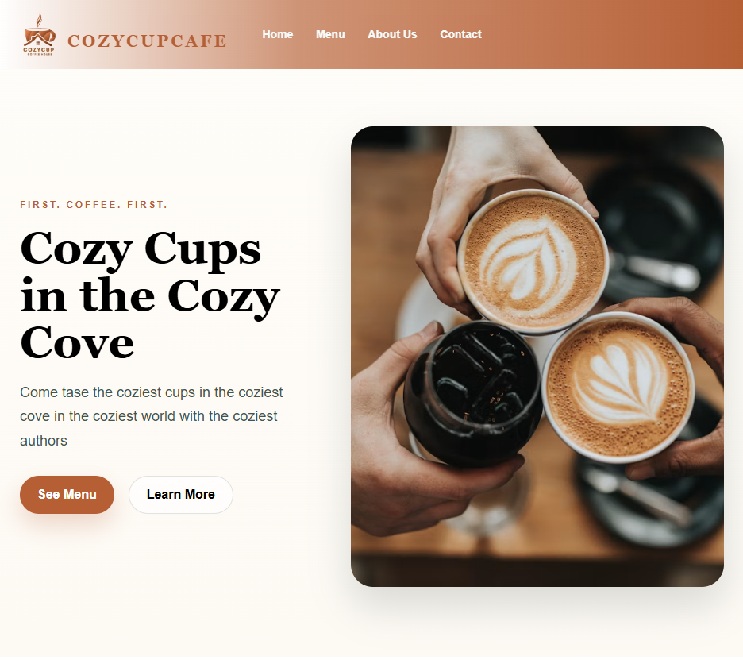
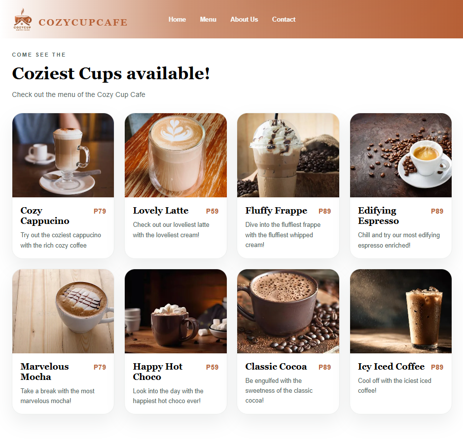
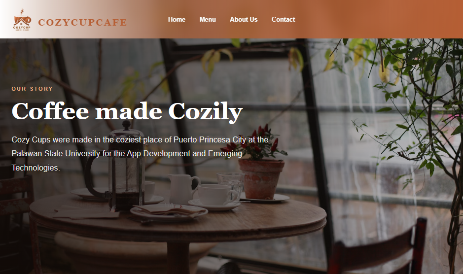
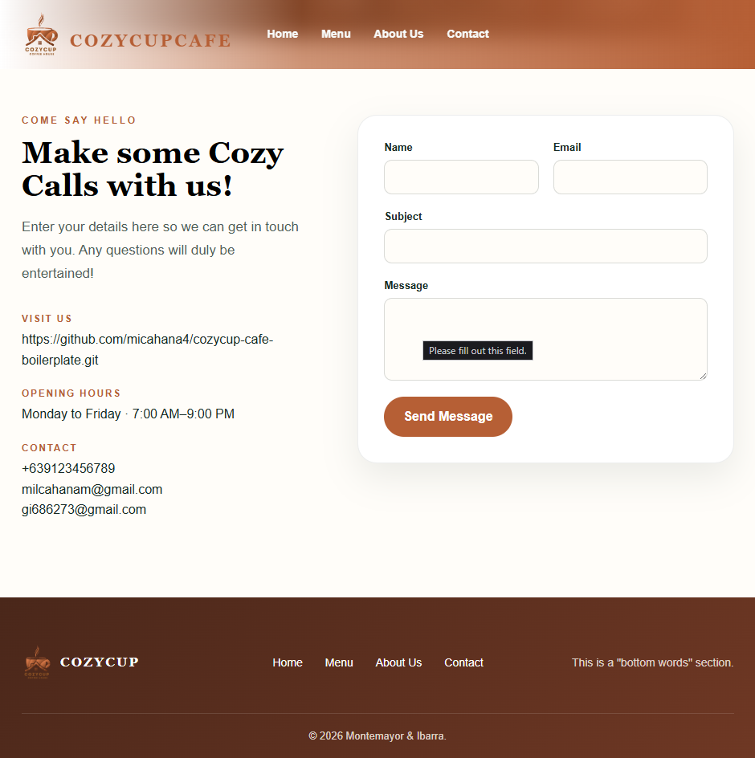

# Project Description

lorem ipsum

 

# Features

- ijajfdcfs
- jwiefdcweck

 

# Screen Captures

## 🏠 Home Screen

> The landing page introduces Cozy Cup Cafe with a welcoming layout, featured coffee image, and quick navigation to the menu and other pages.

## ☕️ Menu Screen

> Displays the cafe's selection of coffee and beverages in a clean card layout, complete with product images, descriptions, and prices.

## 📖 About Us Screen

> Shares the story and mission of Cozy Cup Cafe with an engaging background image and a warm introduction to the cafe.

## 📞 Contact Screen

> Provides the cafe's contact information, opening hours, and a contact form where customers can send inquiries or feedback.

 

# About the Authors

Name: **Milcahana Montemayor**  
Email: **milcahanam@gmail.com**

Name: **Gabriel Jansmhir Ibarra**  
Email: **gi686273@gmail.com**

---

Name:  
Email:
